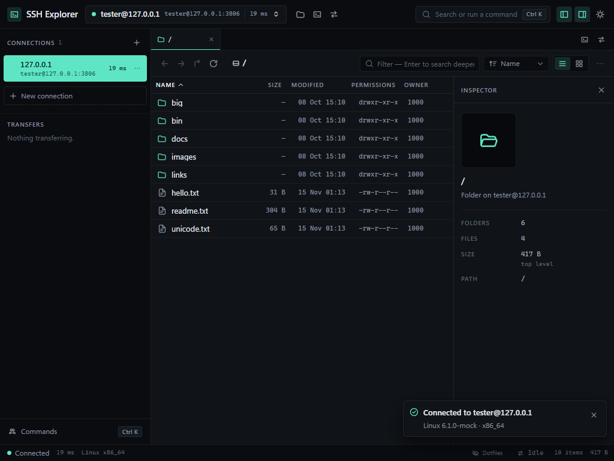
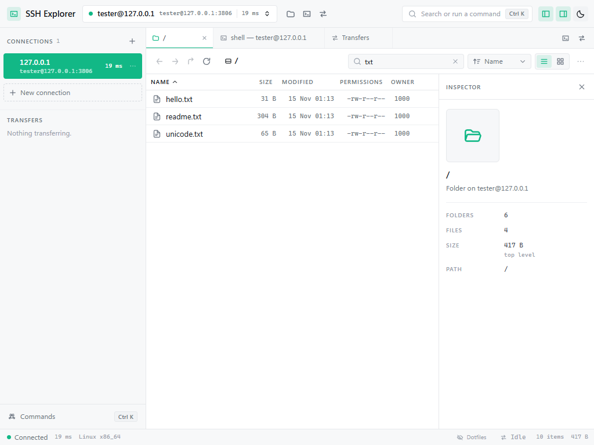
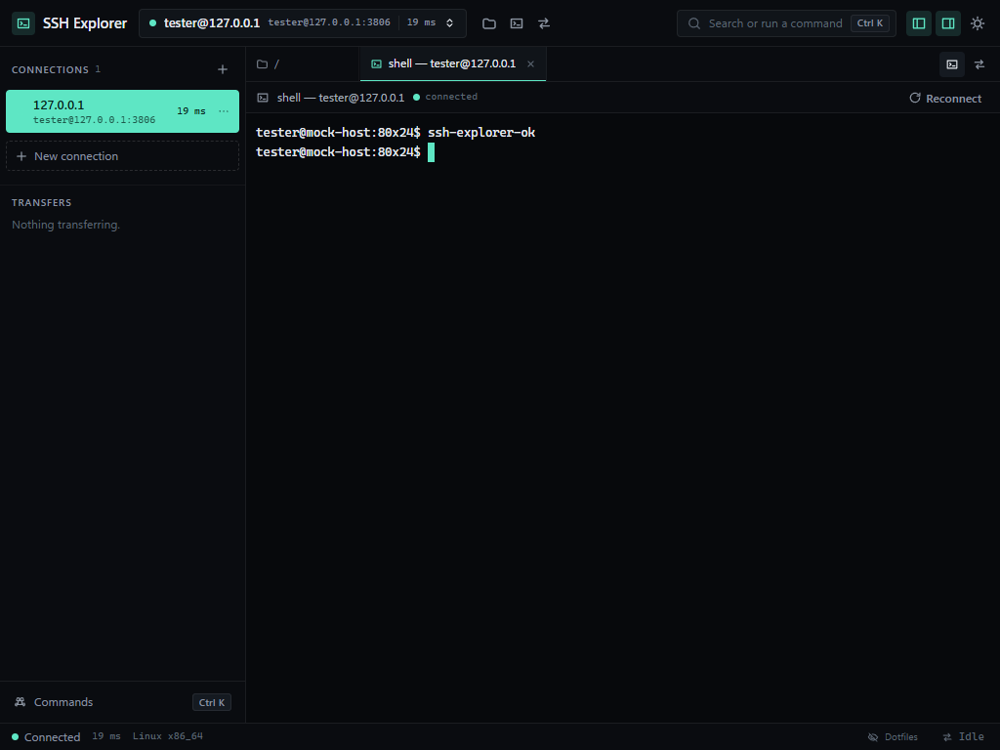
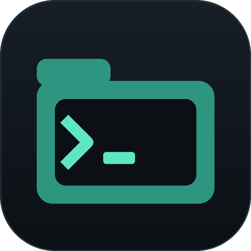

# WooSSH Explorer

A modern file explorer and terminal for remote hosts, over SSH — as a desktop
application, and as a web app from the same code.

The backend speaks SSH/SFTP to the remote host; the frontend behaves like a desktop file
manager: dense sortable tables, multi-select, drag & drop uploads, a live transfer queue,
an inspector with inline previews, and a real PTY terminal.



<details>
<summary>Light theme and terminal</summary>





</details>

The visual concepts this interface was built from live in
[`design/concepts/`](design/concepts); the extraction and comparison ledger is in
[`docs/DESIGN.md`](docs/DESIGN.md).

---

## Desktop app



**Install it once, then launch it from the icon.** The installer creates a Desktop and a
Start Menu shortcut and registers an uninstaller — no terminal, no `npm`, no browser.

```bash
npm install
npm run install-app        # builds, packages and installs for the current user
```

Then double-click **WooSSH Explorer** on the Desktop. It installs per-user under
`%LOCALAPPDATA%\Programs\WooSSH Explorer`, appears in *Add or remove programs*, and needs no
administrator prompt. Remove it with `npm run uninstall-app`.

Prefer not to install anything? `npm run dist` produces two drop-in artifacts in
`release\`:

| file | what it is |
| --- | --- |
| `WooSSH Explorer-Portable-<version>.exe` | one self-contained executable — double-click and it runs |
| `WooSSH Explorer-Setup-<version>.exe` | the installer behind `npm run install-app` |

### What the desktop shell adds

- **A real window** with remembered size, position and maximised state, plus a menu bar
  (File / Edit / View / Connection / Tools / Help) whose commands drive the same actions
  as the keyboard shortcuts.
- **Native "Save as"** for every download, starting in your Downloads folder, with a
  *Show in folder* action when it finishes.
- **Edit in place**: the *Edit* button in the inspector opens the file in your own editor
  and asks *Overwrite on server / Save as… / Cancel* when you save it there.
- **Drag & drop straight from Explorer**, uploading without a browser download bar.
- **Single instance**: launching the shortcut again focuses the window you already have.
- **A loopback-only API on an ephemeral port**, started inside the app — nothing extra to
  run, and no fixed port to collide with a development server.
- Settings, saved hosts and `known_hosts` live in `%APPDATA%\WooSSH Explorer`.

Working on the shell itself:

```bash
npm run app          # builds the web app + shell, then opens the window
npm run app:smoke    # boots the app, asserts the UI and the API, writes a screenshot
npm run app:e2e      # packaged app + a real SSH server: handshake, SFTP listing, download
```

### How the desktop build works

The Electron main process **embeds the API server** instead of spawning it: `esbuild`
compiles `server/dist/server.js` and its dependencies into a single `main.cjs`, the built
web app ships as an extra resource, and `desktop/scripts/build.mjs` is the entire build.
The UI is one bundle for both worlds — it detects the shell through a small preload bridge
and degrades to no-ops in a plain browser.

---

## Web app

```bash
npm install
npm run dev
```

- API + SSH/SFTP service → `http://127.0.0.1:5178`
- Web app → **http://127.0.0.1:5174** (proxies `/api`, including WebSockets)

Open it, press **New connection**, and enter a host you can already reach with `ssh`. Click
a key under *Private key* to use one of your local keys, or switch to *Password*.

Or run the production build from a single port:

```bash
npm run build
npm start            # serves the built web app and the API together
```

`start` prints the URL to open, **including the access token**:

```
WooSSH Explorer ready
  http://127.0.0.1:5178/?token=8Xk2…
```

The token is generated per run and required on every `/api` call, because the API can
reuse your saved credentials — an open port on a shared machine would otherwise be an open
door to your servers. The web app picks the token out of the URL and strips it, so the link
is safe to paste back into the same browser. Set `SSH_EXPLORER_TOKEN` to pin your own, or
`SSH_EXPLORER_NO_TOKEN=1` to turn protection off (it logs a warning; only do this on a
machine nobody else uses). The desktop app generates one internally and never exposes it.

---

## Features
**Browsing**
- Dense file table with name / size / modified / permissions / owner columns, sortable and
  filterable, plus a grid view
- Virtualised table: a folder with tens of thousands of entries scrolls without dropping
  frames, and arrow-key navigation still lands on the right row
- Breadcrumb path bar with an editable path, back / forward / up history per tab
- Multiple tabs; every tab keeps its own path, history, sort, filter and selection
- **`+` in the tab strip** (or `Ctrl T`) asks which session to open in: the one you are already
  in — landing on the folder you are looking at — or another host. Saved hosts that are not up
  yet are offered too, and choosing one starts the connection. Hosts that would otherwise read
  the same get their port appended so the choice is unambiguous.
- Dotfile toggle, symlink targets, recursive search across a subtree
- Inspector panel: file-type tile, full metadata (mode, octal, owner/group, uid/gid, links,
  target), and an inline preview — tokenised text with line numbers, or images as data URLs

**Working with files**
- Create folders, rename, delete (recursively, with an explicit confirmation), change
  permissions, touch
- **Copy, cut and paste** — `Ctrl C`, `Ctrl X`, `Ctrl V`, or the context menu. The bytes move
  server-to-server: copying a directory never streams it through the browser, and pasting
  onto another host relays straight from one SFTP session to the other. Rows waiting on a
  cut are dimmed, and a name that is already taken asks before replacing anything.
- Drag & drop upload from the desktop — **folders included**, walked through
  `webkitGetAsEntry` and recreated on the server; there is a folder picker too
- Multi-file upload, single-file download and multi-file download as a ZIP built on the server
- Transfer queue with per-file progress, speed, ETA, cancel and retry, shown in the sidebar,
  a resizable bottom dock, and a full-page view
- Transfer settings: how many run at once, and an optional combined speed limit that applies
  backpressure instead of dropping the connection

**Interface**
- **English and Russian**, following the browser on first run and switchable from the top bar
- Dark and light themes from one token set, following `prefers-color-scheme` on first run
- Resizable inspector and resizable transfer dock

**Terminal**
- Full xterm.js terminal over a PTY channel, resizable, with reconnect
- Open a shell **in the folder you are looking at** — the tab runs `cd` once the shell is up
- Scrollback search (`Ctrl F` inside the pane), adjustable font size, copy-on-select
- Multiple shell tabs alongside file tabs

**Connections**
- Password, private-key and ssh-agent authentication
- Saved host profiles with colour tags and a private-key path
- **Saved credentials**: opt-in per connection, encrypted at rest, and reused on the next
  connect without typing anything. In the desktop app they are sealed by the operating
  system keychain (DPAPI on Windows); a standalone server falls back to AES-256-GCM with a
  local key file and says so in the dialog instead of implying more protection than it has.
  The API never returns a secret — only the fact that one exists — and *Forget saved
  credentials* is one click away.
- SSH host-key verification with `known_hosts` (TOFU): an unknown key shows its SHA-256
  fingerprint for approval, a *changed* key is refused outright

**Working on the server**
- **Run a command** from the inspector: a command line, a working directory, quick picks
  (`ls -la`, `df -h`, `uname -a`, `file`, `head`, …), and the exit code with stdout/stderr
- **Edit** (desktop): opens the file in whatever application this PC uses for it. When you
  save there, the app asks **Overwrite on server / Save as… / Cancel** — nothing is written
  back until you choose, and "save as" sends the copy to a different remote path.

**Interface**
- Dark and light themes from one token set, following `prefers-color-scheme` on first run
- Resizable inspector: drag its left edge, double-click the handle to reset the width
- Command palette (`Ctrl K`) for hosts, navigation, folders and view actions
- Keyboard driven: `F2` rename, `Delete`, `Ctrl+A`, `Ctrl+C`/`Ctrl+X`/`Ctrl+V`, `Ctrl T` new tab,
  `Enter` open, `Backspace` up, `F5` refresh, `Ctrl L` path, `Ctrl F` filter, `Ctrl B`/`Ctrl I` panels
- Status bar with connection health, latency and folder totals

---

## Quick start

```bash
npm install
npm run dev
```

- API + SSH/SFTP service → `http://127.0.0.1:5178`
- Web app → **http://127.0.0.1:5174** (proxies `/api`, including WebSockets)

Open the web app, press **New connection**, and enter a host you can already reach with
`ssh`. Click a key under *Private key* to use one of your local keys, or switch to
*Password*.

Production build:

```bash
npm run build
npm start            # serves the built web app and the API from one port
```

## Configuration

| variable | default | meaning |
| --- | --- | --- |
| `SSH_EXPLORER_PORT` | `5178` (desktop: OS-assigned) | API port |
| `SSH_EXPLORER_HOST` | `127.0.0.1` | bind address |
| `SSH_EXPLORER_HOME` | `~/.ssh-explorer` (desktop: `%APPDATA%\WooSSH Explorer`) | state directory (`known_hosts`, `profiles.json`) |
| `SSH_EXPLORER_DOWNLOAD_DIR` | `~/Downloads/WooSSH Explorer` (desktop: your Downloads folder) | default download destination |
| `SSH_EXPLORER_STATIC` | `web/dist` when present | built web app to serve |
| `SSH_EXPLORER_LOG_LEVEL` | `info` | `silent`…`debug` |
| `SSH_EXPLORER_TOKEN` | unset | when set, `/api` requires `x-ssh-explorer-token` |

## Security model

- **No stored credentials unless you ask.** Passwords and passphrases live in memory only,
  so reconnect works without persisting anything. If you tick *Save these credentials*, the
  secret goes into an encrypted vault: sealed by the OS keychain in the desktop app, or
  AES-256-GCM with a key file under the state directory for a standalone server. The API
  never hands a secret back to a client.
- **Host keys are pinned after first use.** Known hosts are kept in an OpenSSH-format file
  under `~/.ssh-explorer/` (mode 0600). A key that does not match the stored one fails the
  connection; the UI cannot override it.
- **Binds to loopback by default.** `SSH_EXPLORER_HOST` exists for the case where you
  really do want it on a LAN, and pairing it with `SSH_EXPLORER_TOKEN` is the intended way
  to do that.
- **Secrets are never logged.** Errors are sanitised before they reach the log or the client.
- Previews are size-capped, transfers are streamed, and the API never buffers a whole file.

See [`docs/ARCHITECTURE.md`](docs/ARCHITECTURE.md) for the design and
[`docs/API.md`](docs/API.md) for the full HTTP/WebSocket contract.

## Project layout

```
server/    Express 5 + ssh2 API, SFTP operations, transfers, PTY bridge, known_hosts
web/       React 19 + Vite UI: shell, file browser, inspector, terminal, transfers
desktop/   Electron shell: bundled main process, preload bridge, packaging, icons
docs/      API contract, architecture notes, visual QA ledger
design/    Accepted visual concepts, app icon and QA screenshots
tools/     Browser QA drivers, install/uninstall helpers, standalone mock sshd
```

## Tests

```bash
npm run verify        # typecheck + unit + e2e + production build
npm test              # 128 unit tests  (node:test)
npm run test:e2e      # 69 integration tests against a real SSH server
npm run typecheck     # all three workspaces
npm run qa            # browser QA: screenshots + functional assertions
npm run app:smoke     # desktop shell boots, renders and talks to its API
npm run app:e2e       # packaged desktop app + real SSH, SFTP, download and edit round trip
```

The e2e suite starts `server/test/support/mockSshServer.ts` — a genuine SSH server built
on `ssh2`'s `Server` class, backed by a real temporary directory, not a stub — then drives
the public HTTP and WebSocket API against it: authentication failures, host-key trust and
rotation, directory listings, byte-exact upload/download round-trips, ZIP batches with a
dependency-free reader that verifies CRC-32 and sizes, cancellation, terminal I/O and the
error envelope on every failure path.

`npm run qa` drives Chromium through the whole product (connect → trust → browse →
select → preview → search → terminal → transfers) against the production build and fails
on any console error, page exception or failed request. `npm run qa:token` covers the
shared-secret mode. `npm run mock-ssh` runs the mock sshd standalone if you want a target
to click around against.

`npm run app:e2e` is the desktop equivalent: it starts the mock sshd, boots the **packaged**
application, and asserts that the window renders, the menu exists, the preload bridge is
exposed, the embedded API answers, a download lands on disk through Electron's save
pipeline, a real SSH handshake reaches an SFTP listing, and the edit round trip completes
(download → simulated local save → the *changed* prompt → overwrite → the new bytes read
back from the server) — all inside the shipped artifact, not the source tree.

Verified state of the tree: **128/128 unit**, **69/69 e2e**, typecheck clean across all
three workspaces, production build green, browser QA clean, desktop smoke and packaged
end-to-end green, installer built and installed with working Desktop and Start Menu
shortcuts.
